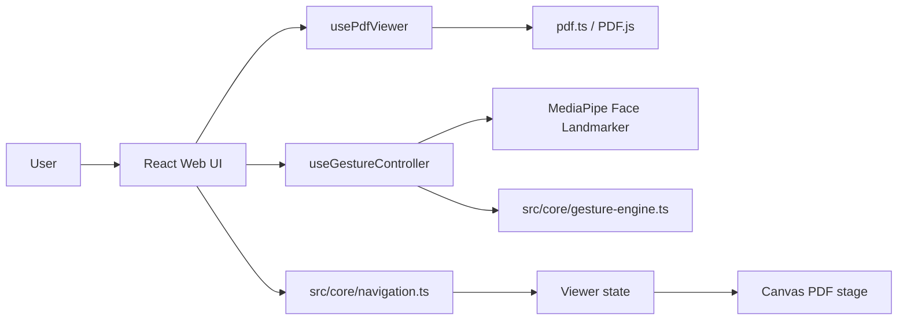
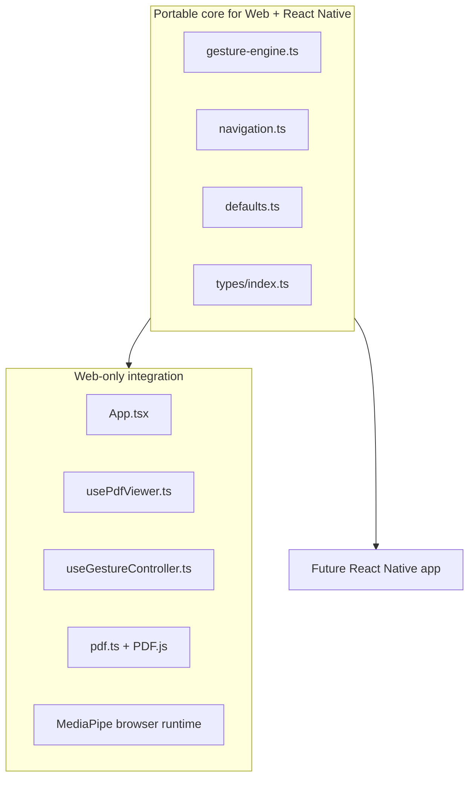

# Handsfree PDF Reader

Browser-first hands-free PDF navigation using webcam wink detection and head-turn gestures.

## Product shape
- **Web MVP first**: desktop browser PDF reader
- **React Native later**: keep gesture + navigation logic portable
- **Privacy-first**: camera processing stays in-browser
- **Input model**: left/right wink + head-turn thresholds + cooldowns

## Architecture overview



## Portability split



## Current repository layout

```text
.
├── docs/
│   ├── ARCHITECTURE.md
│   ├── IMPLEMENTATION_PLAN.md
│   ├── PRD.md
│   ├── TEST_GUIDE.md
│   └── WIREFRAMES.md
├── public/
│   └── index.html
├── src/
│   ├── components/
│   ├── core/
│   ├── hooks/
│   ├── lib/
│   ├── styles/
│   ├── test/
│   ├── types/
│   ├── App.tsx
│   └── main.tsx
├── package.json
├── tsconfig.json
└── webpack.config.mjs
```

## Runtime flow
1. User uploads a PDF.
2. `usePdfViewer` loads the file through PDF.js and renders page 1 to canvas.
3. User starts webcam capture.
4. `useGestureController` runs MediaPipe face detection in a browser loop.
5. Landmarks are passed into `src/core/gesture-engine.ts`.
6. Gesture events are mapped into navigation actions through `src/core/navigation.ts`.
7. Viewer state updates and the next/previous page is rendered.

## MVP scope
- PDF upload
- First-page render and page navigation
- Webcam start/stop
- Left/right wink navigation
- Head left/right navigation
- Tunable threshold and cooldown controls
- Local-only browser processing

## Testing
- Manual test scenarios: `src/test/scenarios.ts`
- QA checklist and environment guide: `docs/TEST_GUIDE.md`

## Next build steps
1. Install dependencies
   ```bash
   npm install
   ```
2. Start development server
   ```bash
   npm run dev
   ```
3. Build production bundle
   ```bash
   npm run build
   ```

## GitHub Pages deployment
- This repo is configured to deploy from GitHub Actions.
- Production build uses `PUBLIC_PATH=/handsfree-pdf-reader/` for Pages asset routing.
- After the workflow runs, the expected URL is:
  - `https://rumblebot-0318.github.io/handsfree-pdf-reader/`

### Notes for Pages
- HTTPS is available, so webcam access can work.
- Gesture runtime still depends on external MediaPipe model/wasm loading and browser camera permissions.
- If Pages works but gesture startup fails, inspect browser console/network requests first.

## Notes
- The current goal is a **web MVP with portable core logic**, not a shared monorepo yet.
- When mobile work starts, move `src/core` and `src/types` into a reusable package boundary.
